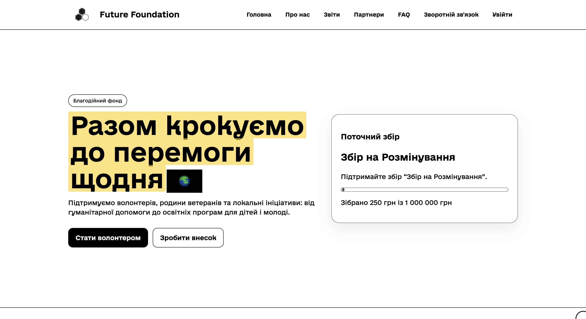

# Future Foundation




Charity foundation website with:
- public multi-page frontend
- admin authentication and post management
- public campaigns, reports, partners, FAQ, feedback/comments
- Express + Prisma backend API

## Stack

- Frontend: HTML, CSS, vanilla JavaScript, Webpack
- Backend: Node.js, Express, Prisma, Neon/PostgreSQL
- Auth: JWT
- Content/admin: custom admin panel for `admin` and `editor`

## Project Structure

```text
frontend/
  src/        source HTML/CSS/JS pages
  public/     copied static assets, llms.txt, robots.txt
  webpack.config.js

backend/
  src/        Express app, controllers, routes, middleware
  prisma/     Prisma schema + migration files
  seed/       seed script

docs/         production frontend build output for local/static hosting
render.yaml   Render deployment definition
```

## Public Pages

- `/index.html` - homepage, featured campaign, events, FAQ preview, contact form
- `/about.html` - organization overview
- `/campaigns.html` - fundraising campaigns
- `/cases.html` - impact cases
- `/posts.html` - news archive
- `/post.html?slug=...` - individual news post
- `/reports.html` - transparency and reports
- `/partners.html` - partners page
- `/faq.html` - FAQ page
- `/feedback.html` - feedback + threaded comments

## Admin Pages

- `/admin-login.html`
- `/admin-posts.html`
- `/admin-post-editor.html`

Server redirects also support:
- `/admin/login`
- `/admin/dashboard/posts`
- `/admin/dashboard/posts/new`
- `/admin/dashboard/posts/:id/edit`

## Current Frontend Implementation

- Multi-page build generated from every HTML file in `frontend/src`
- Shared global styling and page-specific CSS bundled by Webpack
- Static assets copied from `frontend/public`
- Favicon included on all HTML entry pages
- `robots.txt` and `llms.txt` shipped from `frontend/public`
- Responsive mobile menu with fixed overlay behavior
- Loader screen locks page scroll until intro finishes
- Hero title uses animated yellow highlight sweep
- Progress bars animate their fill on render
- Frontend API base supports:
  - same-origin by default in production
  - `localhost:3000` in local dev
  - injected `FF_API_BASE` at build time for static hosting such as Render

## Current Backend Implementation

- Express app with JSON API under `/api/*`
- Prisma-backed persistence
- JWT auth for admin/editor flows
- RBAC:
  - `admin`: full post management, publish, delete
  - `editor`: own-post management, review submission, no publish/delete
- Public read endpoints for posts, campaigns, partners, reports, activities, FAQ, help options, reviews, comments
- Comment system:
  - guest actor session
  - threaded comments
  - reactions
  - soft delete

## Security / Validation

- Password hashing with `bcryptjs`
- JWT auth for protected routes
- Prisma query API used instead of raw SQL
- Input validation on:
  - auth login
  - public contact/request form
  - admin post create/update
  - comments/auth/session flows
- Client-side validation added for:
  - homepage contact form
  - admin login form
- Suspicious input patterns rejected on client and server:
  - basic XSS-style tags/attributes/protocols
  - control characters
  - malformed email/phone/name inputs
- Contact form requires a non-empty message

## Local Development

### Backend

1. Go to `backend/`
2. Create/update `.env`
3. Install dependencies
4. Prepare database
5. Start the server

Example:

```bash
cd backend
yarn install
yarn db:push
node seed/index.js
yarn dev
```

Required env vars:

```env
DATABASE_URL=
JWT_SECRET=
PORT=3000
ALLOWED_ORIGIN=http://localhost:9000,http://127.0.0.1:9000
```

Optional env vars:

```env
MONO_TOKEN=
INTERNAL_API_TOKEN=
MONO_SYNC_MIN_INTERVAL_MS=300000
MONO_PUBLIC_REFRESH_MIN_INTERVAL_MS=30000
JWT_EXPIRES_IN=12h
```

### Frontend

```bash
cd frontend
npm install
npm run dev
```

Default local frontend dev server:
- `http://localhost:9000`

Production-style static build:

```bash
cd frontend
npm run build
```

Default output:
- `docs/`

If you want a different output folder:

```bash
BUILD_OUTPUT_DIR=dist npm run build
```

## Seeded Credentials

- Admin: `admin@example.com` / `Admin123!`
- Editor: `editor@example.com` / `Editor123!`

## Render Deployment

This repo now includes [render.yaml](./render.yaml) for deploying both backend and frontend on Render.

### Backend Render service

- Service type: `web`
- Root directory: `backend`
- Build command: `yarn install --frozen-lockfile && yarn build`
- Start command: `yarn start`

Set these env vars in Render:

- `DATABASE_URL`
- `JWT_SECRET`
- `ALLOWED_ORIGIN`
- `MONO_TOKEN` if Monobank sync is needed
- `INTERNAL_API_TOKEN` if internal routes are used

`ALLOWED_ORIGIN` should include the final frontend Render URL, for example:

```env
ALLOWED_ORIGIN=https://charity-web-frontend.onrender.com
```

### Frontend Render service

- Service type: `static`
- Root directory: `frontend`
- Build command: `npm ci && npm run build`
- Publish directory: `dist`

Set this env var in Render:

- `FF_API_BASE`

Example:

```env
FF_API_BASE=https://charity-web-backend.onrender.com
```

The frontend build uses:
- `BUILD_OUTPUT_DIR=dist`
- `FF_API_BASE` to point the static site to the backend

## LLM / Crawl Metadata

Shipped from `frontend/public/`:

- `/llms.txt`
- `/robots.txt`

Purpose:
- help LLMs understand the public site structure
- allow public pages
- discourage crawling admin pages and admin/auth APIs

## Notes

- The frontend is not a SPA; each public/admin page is a separate HTML entry.
- Local `docs/` is the generated static build output and can be deployed as plain static hosting.
- If frontend and backend are hosted on different origins, `FF_API_BASE` and backend `ALLOWED_ORIGIN` must both be configured.
